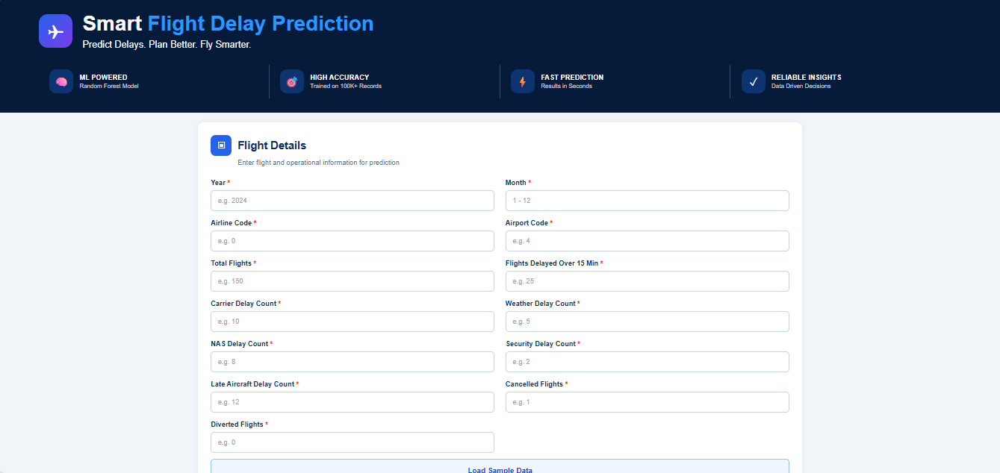
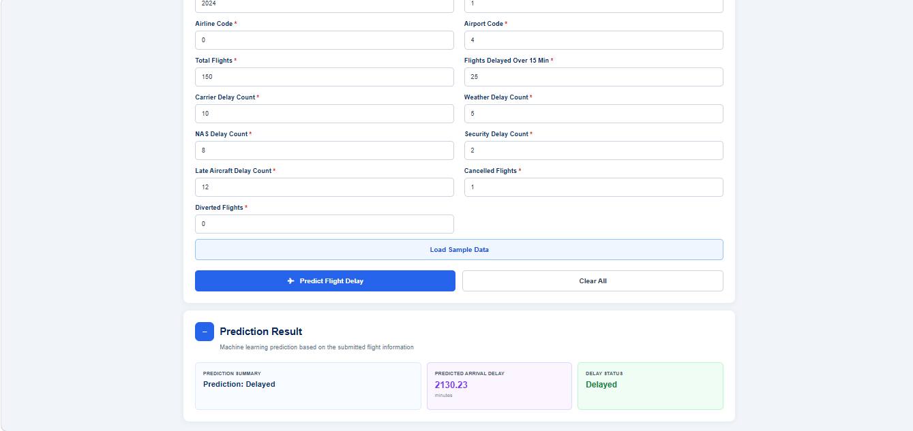
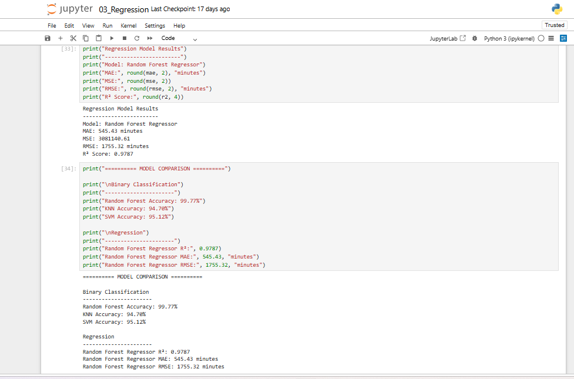

\# Flight Delay Prediction

\## Project Overview

Flight Delay Prediction is a machine learning project that analyzes historical airline flight data to predict flight delays.

The project implements two machine learning tasks:

1\. \*\*Classification\*\* – predicts whether a flight is Delayed or Not Delayed.

2\. \*\*Regression\*\* – predicts the expected Arrival Delay in minutes.

The trained models are integrated into a Flask web application that allows users to enter flight information and obtain predictions through a browser-based interface.

\---

\## Objectives

\- Analyze historical airline delay data.

\- Perform data cleaning and preprocessing.

\- Encode categorical flight and airport information.

\- Develop a binary flight-delay classification model.

\- Develop a regression model for predicting arrival delay duration.

\- Compare different classification algorithms.

\- Evaluate the models using appropriate performance metrics.

\- Deploy the trained models through a Flask web application.

\---

\## Dataset

The project uses the \*\*Airline Delay Cause Dataset\*\*.

The original dataset contains 101,315 records and 14 attributes. After preprocessing and removing incomplete records, 100,960 records were used for modelling.

Important variables include:

\- Year

\- Month

\- AirlineCode

\- AirportCode

\- TotalFlights

\- FlightsDelayedOver15Min

\- CarrierDelayCount

\- WeatherDelayCount

\- NASDelayCount

\- SecurityDelayCount

\- LateAircraftDelayCount

\- CancelledFlights

\- DivertedFlights

\- ArrivalDelayMinutes

\---

\## Machine Learning Approach

\### 1. Data Preprocessing

The preprocessing stage includes:

\- Loading the dataset

\- Handling incomplete records

\- Selecting relevant features

\- Encoding categorical variables

\- Creating the binary delay target

\- Separating features and target variables

`AirlineCode` and `AirportCode` are encoded into numerical representations for the modelling pipeline.

\---

\### 2. Classification

The classification task predicts whether a flight is:

\- \*\*Delayed\*\*

\- \*\*Not Delayed\*\*

The following classification algorithms were evaluated:

\- Random Forest

\- K-Nearest Neighbors (KNN)

\- Support Vector Machine (SVM)

\### Classification Results

| Model | Accuracy |

|---|---:|

| Random Forest | \*\*99.77%\*\* |

| SVM | 95.12% |

| KNN | 94.70% |

Random Forest achieved the highest recorded accuracy among the evaluated classification models and was selected as the primary classification model.

\---

\## Regression

The regression task predicts:

\*\*ArrivalDelayMinutes\*\*

A Random Forest Regressor was trained using the processed flight features.

\### Regression Results

| Metric | Result |

|---|---:|

| MAE | 545.43 minutes |

| MSE | 3,081,140.61 |

| RMSE | 1,755.32 minutes |

| R² | 0.9787 |

These metrics provide different views of regression performance. MAE measures average absolute error, MSE emphasizes larger errors, RMSE expresses error in the target unit, and R² measures the variation explained by the model.

\---

\## Model Evaluation

\### Classification Evaluation

Classification performance was evaluated using:

\- Accuracy

\- Precision

\- Recall

\- Confusion Matrix

The confusion matrix was used to examine correctly and incorrectly classified delayed and non-delayed observations.

\### Regression Evaluation

Regression performance was evaluated using:

\- Mean Absolute Error (MAE)

\- Mean Squared Error (MSE)

\- Root Mean Squared Error (RMSE)

\- R² Score

\- Actual vs Predicted visualization

\---

\## Application Architecture

The project follows the workflow below:

1\. \*\*Historical Flight Data\*\*

&#x20;  - Historical airline flight delay data is used as the input dataset.

2\. \*\*Data Preprocessing\*\*

&#x20;  - The dataset is cleaned and prepared for machine learning.

3\. \*\*Feature Engineering\*\*

&#x20;  - Relevant numerical and categorical features are prepared for modelling.

4\. \*\*Machine Learning\*\*

&#x20;  - \*\*Classification:\*\* Random Forest Classifier predicts whether a flight is delayed.

&#x20;  - \*\*Regression:\*\* Random Forest Regressor predicts the arrival delay in minutes.

5\. \*\*Model Storage\*\*

&#x20;  - The trained models and preprocessing components are saved as `.pkl` files.

6\. \*\*Flask Backend\*\*

&#x20;  - The saved models are loaded by the Flask application.

7\. \*\*Web Interface\*\*

&#x20;  - Users enter flight information through the web interface.

8\. \*\*Prediction\*\*

&#x20;  - The application returns the predicted delay status and predicted arrival delay.

## Project Screenshots

### Flask Web Interface

The Flask web application provides a user-friendly interface for entering flight and operational information.

### Flight Delay Prediction Result

The application displays the predicted delay status and estimated arrival delay after submitting the flight information.

### Model Evaluation Results

The machine learning models were evaluated using classification accuracy and regression metrics including MAE, MSE, RMSE, and R².

